## Outline { .nonum }

<style type="text/css">
@import url("https://maxcdn.bootstrapcdn.com/font-awesome/4.6.3/css/font-awesome.min.css");
@import url("https://cdn.rawgit.com/gaborcsardi/r-font/master/rlogo.css");
</style>


### 1. Motivation: high quality R packages

### 2. Existing tools: <br> `R CMD check`, `covr`, `lintr`

### 3. The `goodpractice` package

### 4. Cylomatic complexity: `cyclocomp`

### 5. XML parse data and linting: `xmlparsedata`

### 6. Function map: `functionMap`

## Motivation

<div class="double">
<p class="double-flow">

  <span class="icon-rlogo-alt" aria-hidden="true"></span>&nbsp;&nbsp;
  High quality R packages 

  <span class="fa fa-gift fa-fw" aria-hidden="true"></span>&nbsp;&nbsp;
  Package building advice

  <span class="fa fa-wrench fa-fw" aria-hidden="true"></span>&nbsp;&nbsp;
  Custom rule sets

  <span class="fa fa-cog fa-spin fa-fw" aria-hidden="true"></span>&nbsp;&nbsp;
  Use in a CI

</p><p class="double-flow">

  <span class="fa fa-file-code-o fa-fw" aria-hidden="true"></span>&nbsp;&nbsp;
  Code quality

  <span class="fa fa-check fa-fw" aria-hidden="true"></span>&nbsp;&nbsp;
  Good practices

  <span class="fa fa-area-chart fa-fw" aria-hidden="true"></span>&nbsp;&nbsp;
  Test coverage

  <span class="fa fa-file-text-o fa-fw" aria-hidden="true"></span>&nbsp;&nbsp;
  Documentation quality

</p>
</div>

## { .fullpage }

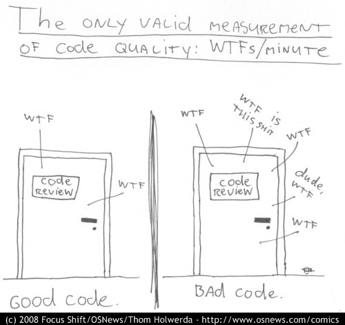

# Existing Tools

# `R CMD check` { style="font-size: 70%" }

## { .fullpage }
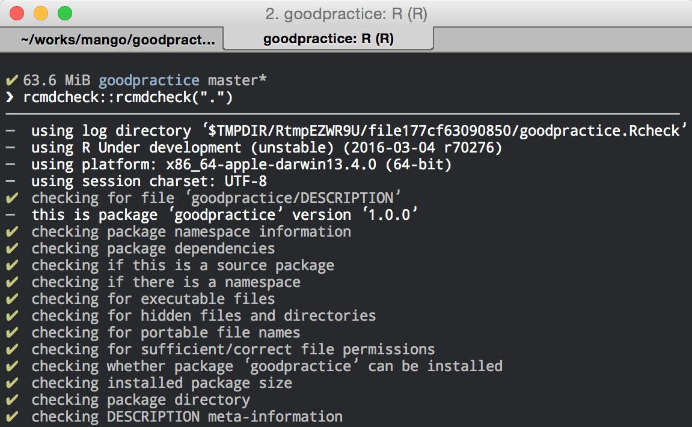

# `jimhester/covr` { style="font-size: 70%" }

## { .fullpage }
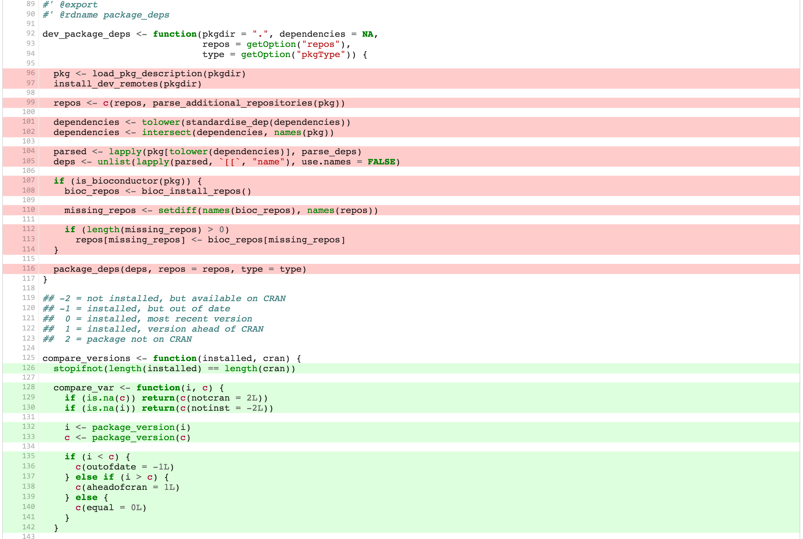

# `jimhester/lintr` { style="font-size: 70%" }

## { .fullpage }
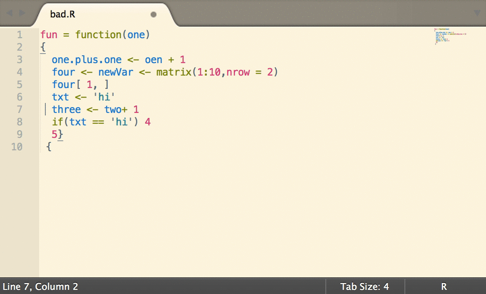

# `goodpractice` { style="font-size: 70%" }

## GP Checks

<div class="double">
<p class="double-flow">

  <span class="fa fa-check fa-fw" aria-hidden="true"></span>&nbsp;&nbsp;
  `R CMD check`

  <span class="fa fa-check fa-fw" aria-hidden="true"></span>&nbsp;&nbsp;
  Test coverage (via `covr`)

  <span class="fa fa-check fa-fw" aria-hidden="true"></span>&nbsp;&nbsp;
  Anti-patterns `1:length(x)`

  <span class="fa fa-check fa-fw" aria-hidden="true"></span>&nbsp;&nbsp;
  Code complexity

</p><p class="double-flow">

  <span class="fa fa-check fa-fw" aria-hidden="true"></span>&nbsp;&nbsp;
  Code quality

  <span class="fa fa-check fa-fw" aria-hidden="true"></span>&nbsp;&nbsp;
  Package dependencies

  <span class="fa fa-check fa-fw" aria-hidden="true"></span>&nbsp;&nbsp;
  Documentation

  <span class="fa fa-check fa-fw" aria-hidden="true"></span>&nbsp;&nbsp;
  Code style (via `lintr`)

## { .fullpage }
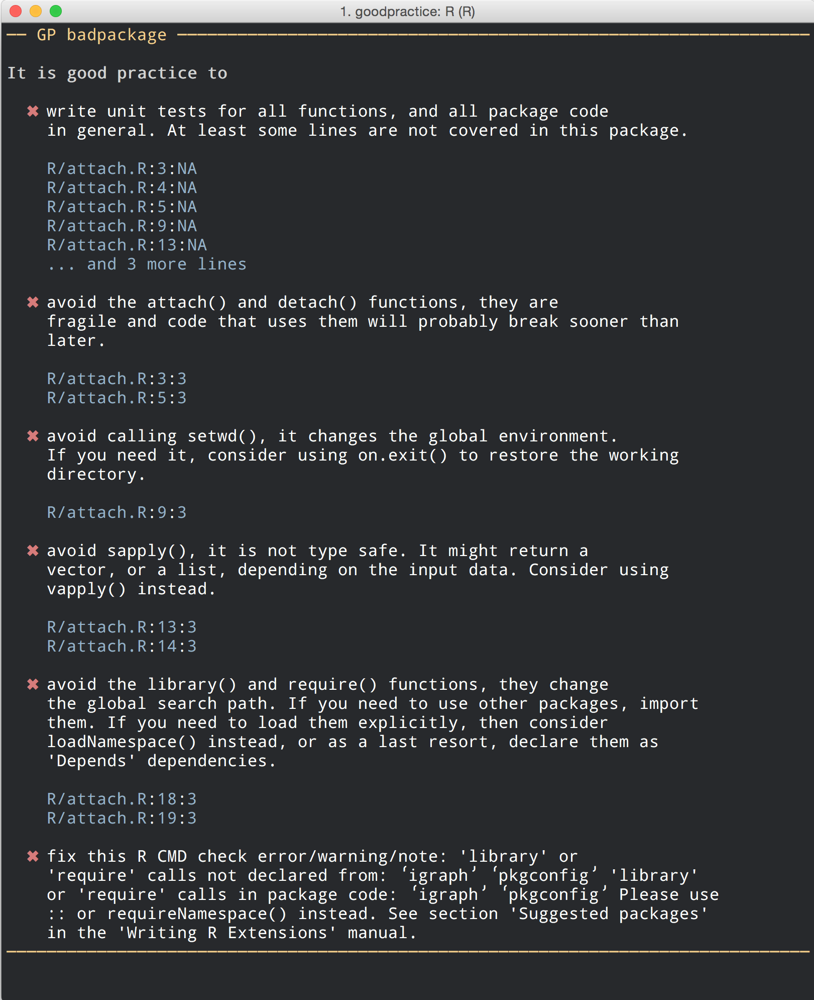

## { .fullpage }
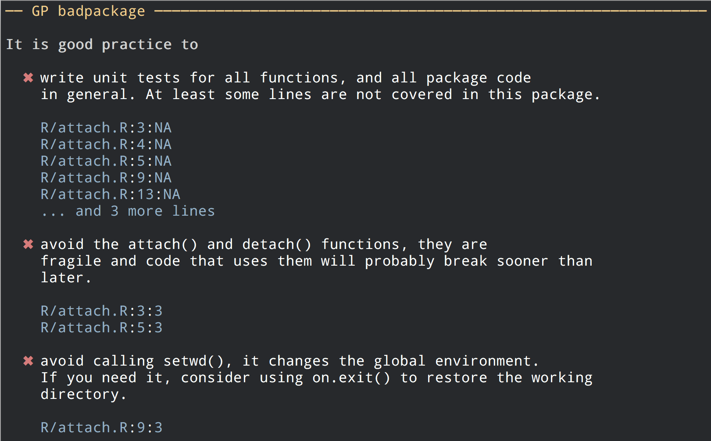

## { .fullpage }
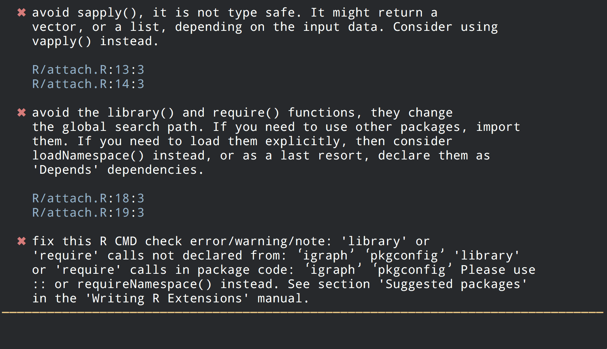

# `cyclocomp` { style="font-size: 70%" }

## Cyclomatic complexity


1. By Thomas J. McCabe, Sr. in 1976
1. Control flow graphs
1. Number of linearly independent paths
1. Limit complexity during development
1. Calibrate/estimate number of tests

# `xmlparsedata` { style="font-size: 70%" }

## Linting: labeled subgraph isomorphisms

Example: search for `1:nrow(<expression>)`

```
<expr>
  +-- <expr>
    +-- NUM_CONST: 1
  +-- ':'
  +-- <expr>
    +-- <expr>
      +-- SYMBOL_FUNCTION_CALL nrow
    +-- '('
    +-- <expr>
    +-- ')'
```	

## Easy with `XPath`

Example: search for `1:nrow(<expr>)`

```
//expr
  [expr[NUM_CONST[text()='1']]]
  [OP-COLON]
  [expr[expr[SYMBOL_FUNCTION_CALL[text()='nrow']]]]
```

Just convert the R parse tree to XML!

# `functionMap` { style="font-size: 70%" }

## { .fullpage }
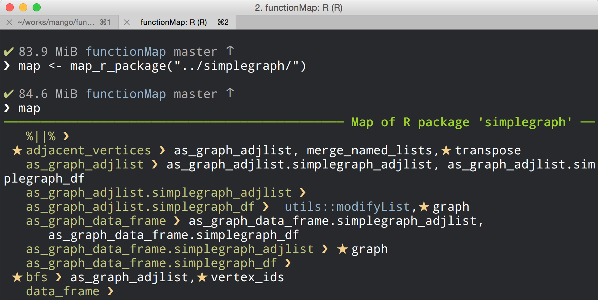

## { .fullpage }
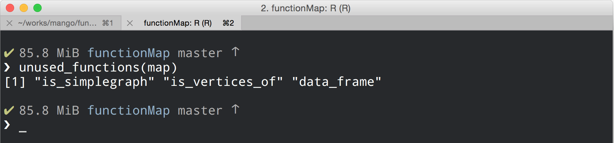

## { .fullpage }

<div style="margin-top:-100px;"></div>

```json
{
  "package": "simplegraph",
  "exports": ["adjacent_vertices", "bfs", "degree" ],
  "functions": [
    {
      "ID": "is_simplegraph",
      "file": "R/assertions.R",
      "line": 12,
      "col1": 19,
      "col2": 26
    }
  ],
  "calls": [
    {
      "from": "is_simplegraph",
      "to": "methods::is",
      "file": "R/assertions.R",
      "line": 13,
      "col1": 3,
      "col2": 4
    }	
  ]
}
```

# But wait!

## { .fullpage }
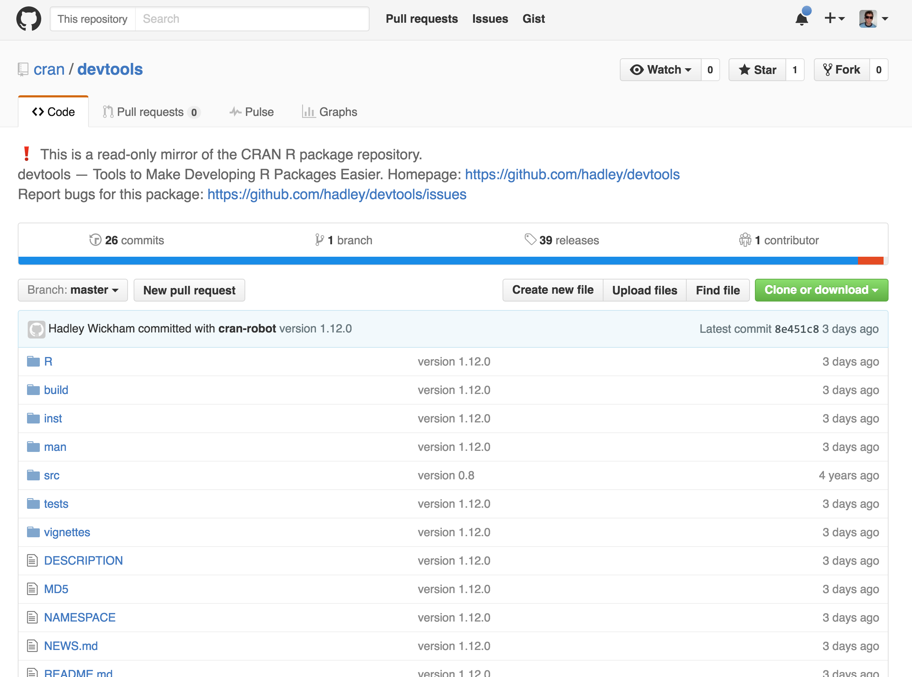

## { .fullpage }
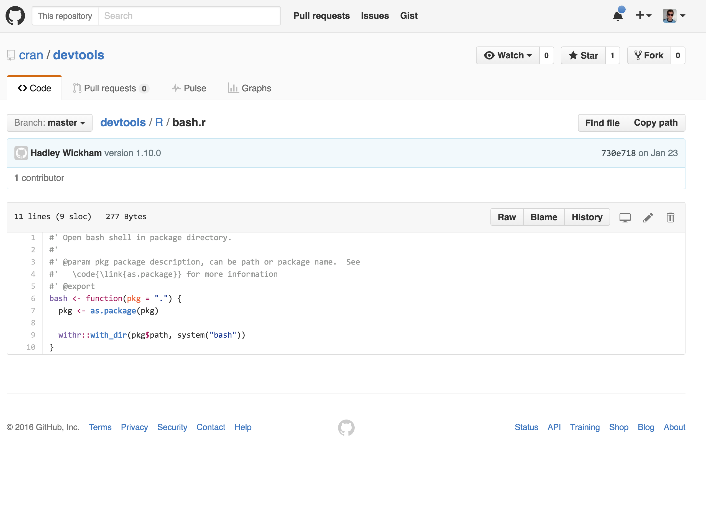

# Questions?
